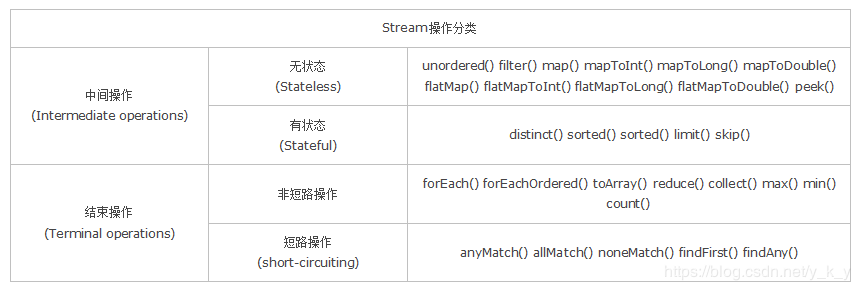

## 一、概述
Stream 是 Java8 中处理集合的关键抽象概念，它可以指定你希望对集合进行的操作，可以执行非常复杂的查找、过滤和映射数据等操作。使用Stream API 对集合数据进行操作，就类似于使用 SQL 执行的数据库查询。也可以使用 Stream API 来并行执行操作。简而言之，Stream API 提供了一种高效且易于使用的处理数据的方式。

特点：

1. 不是数据结构，不会保存数据。

2. 不会修改原来的数据源，它会将操作后的数据保存到另外一个对象中。（保留意见：毕竟peek方法可以修改流中元素）

3. 惰性求值，流在中间处理过程中，只是对操作进行了记录，并不会立即执行，需要等到执行终止操作的时候才会进行实际的计算。
## 二、分类

无状态：指元素的处理不受之前元素的影响；

有状态：指该操作只有拿到所有元素之后才能继续下去。

非短路操作：指必须处理所有元素才能得到最终结果；

短路操作：指遇到某些符合条件的元素就可以得到最终结果，如 A || B，只要A为true，则无需判断B的结果。
## 三、具体用法
### 1. 流的常用创建方法
1.1 使用Collection下的 stream() 和 parallelStream() 方法
```
List<String> list = new ArrayList<>();
Stream<String> stream = list.stream(); //获取一个顺序流
Stream<String> parallelStream = list.parallelStream(); //获取一个并行流
```
1.2 使用Arrays 中的 stream() 方法，将数组转成流
```
Integer[] nums = new Integer[10];
Stream<Integer> stream = Arrays.stream(nums);
```
1.3 使用Stream中的静态方法：of()、iterate()、generate()

```
Stream<Integer> stream = Stream.of(1,2,3,4,5,6);
  
Stream<Integer> stream2 = Stream.iterate(0, (x) -> x + 2).limit(6);
stream2.forEach(System.out::println); // 0 2 4 6 8 10
  
Stream<Double> stream3 = Stream.generate(Math::random).limit(2);
stream3.forEach(System.out::println);
```
1.4 使用 BufferedReader.lines() 方法，将每行内容转成流
 ```
 BufferedReader reader = new BufferedReader(new FileReader("F:\\test_stream.txt"));
Stream<String> lineStream = reader.lines();
lineStream.forEach(System.out::println);
 ```
 1.5 使用 Pattern.splitAsStream() 方法，将字符串分隔成流
 ```
 Pattern pattern = Pattern.compile(",");
Stream<String> stringStream = pattern.splitAsStream("a,b,c,d");
stringStream.forEach(System.out::println);
 ```
 ### 2. 流的中间操作
 2.1 筛选与切片(对应SQL where 条件和limit offset)
1. filter：过滤流中的某些元素
2. limit(n)：获取n个元素
3. skip(n)：跳过n元素，配合limit(n)可实现分页
4. distinct：通过流中元素的 hashCode() 和 equals() 去除重复元素
```
Stream<Integer> stream = Stream.of(6, 4, 6, 7, 3, 9, 8, 10, 12, 14, 14);
  
Stream<Integer> newStream = stream.filter(s -> s > 5) //6 6 7 9 8 10 12 14 14
.distinct() //6 7 9 8 10 12 14
.skip(2) //9 8 10 12 14
.limit(2); //9 8
newStream.forEach(System.out::println);
```
2.2 映射(select的字段的处理)
1. map：接收一个函数作为参数，该函数会被应用到每个元素上，并将其映射成一个新的元素。
2. flatMap：接收一个函数作为参数，将流中的每个值都换成另一个流，然后把所有流连接成一个流。
```
List<String> list = Arrays.asList("a,b,c", "1,2,3");
  
//将每个元素转成一个新的且不带逗号的元素
Stream<String> s1 = list.stream().map(s -> s.replaceAll(",", ""));
s1.forEach(System.out::println); // abc 123
  
Stream<String> s3 = list.stream().flatMap(s -> {
//将每个元素转换成一个stream
String[] split = s.split(",");
Stream<String> s2 = Arrays.stream(split);
return s2;
});
s3.forEach(System.out::println); // a b c 1 2 3
```
2.3 排序
1. sorted()：自然排序，流中元素需实现Comparable接口
2. sorted(Comparator com)：定制排序，自定义Comparator排序器
```
List<String> list = Arrays.asList("aa", "ff", "dd");
//String 类自身已实现Compareable接口
list.stream().sorted().forEach(System.out::println);// aa dd ff
  
Student s1 = new Student("aa", 10);
Student s2 = new Student("bb", 20);
Student s3 = new Student("aa", 30);
Student s4 = new Student("dd", 40);
List<Student> studentList = Arrays.asList(s1, s2, s3, s4);
  
//自定义排序：先按姓名升序，姓名相同则按年龄升序
studentList.stream().sorted(
(o1, o2) -> {
if (o1.getName().equals(o2.getName())) {
return o1.getAge() - o2.getAge();
} else {
return o1.getName().compareTo(o2.getName());
}
}
).forEach(System.out::println);　
```
2.4 消费
1. peek：如同于map，能得到流中的每一个元素。但map接收的是一个Function表达式，有返回值；而peek接收的是Consumer表达式，没有返回值。
```
Student s1 = new Student("aa", 10);
Student s2 = new Student("bb", 20);
List<Student> studentList = Arrays.asList(s1, s2);
  
studentList.stream()
.peek(o -> o.setAge(100))
.forEach(System.out::println);
  
//结果：
Student{name='aa', age=100}
Student{name='bb', age=100}
```
### 3. 流的终止操作
3.1 匹配、聚合操作
1. allMatch：接收一个 Predicate 函数，当流中每个元素都符合该断言时才返回true，否则返回false
2. noneMatch：接收一个 Predicate 函数，当流中每个元素都不符合该断言时才返回true，否则返回false
3. anyMatch：接收一个 Predicate 函数，只要流中有一个元素满足该断言则返回true，否则返回false
4. findFirst：返回流中第一个元素
5. findAny：返回流中的任意元素
6. count：返回流中元素的总个数
7. max：返回流中元素最大值
8. min：返回流中元素最小值
```
List<Integer> list = Arrays.asList(1, 2, 3, 4, 5);
  
boolean allMatch = list.stream().allMatch(e -> e > 10); //false
boolean noneMatch = list.stream().noneMatch(e -> e > 10); //true
boolean anyMatch = list.stream().anyMatch(e -> e > 4); //true
  
Integer findFirst = list.stream().findFirst().get(); //1
Integer findAny = list.stream().findAny().get(); //1
  
long count = list.stream().count(); //5
Integer max = list.stream().max(Integer::compareTo).get(); //5
Integer min = list.stream().min(Integer::compareTo).get(); //1　　
```
3.2 规约操作
Optional reduce(BinaryOperator accumulator)：第一次执行时，accumulator函数的第一个参数为流中的第一个元素，第二个参数为流中元素的第二个元素；第二次执行时，第一个参数为第一次函数执行的结果，第二个参数为流中的第三个元素；依次类推。
1. T reduce(T identity, BinaryOperator accumulator)：流程跟上面一样，只是第一次执行时，accumulator函数的第一个参数为identity，而第二个参数为流中的第一个元素。
2. U reduce(U identity,BiFunction<U, ? super T, U> accumulator,BinaryOperator combiner)：在串行流(stream)中，该方法跟第二个方法一样，即第三个参数combiner不会起作用。在并行流(parallelStream)中,我们知道流被fork join出多个线程进行执行，此时每个线程的执行流程就跟第二个方法reduce(identity,accumulator)一样，而第三个参数combiner函数，则是将每个线程的执行结果当成一个新的流，然后使用第一个方法reduce(accumulator)流程进行规约。
```
//经过测试，当元素个数小于24时，并行时线程数等于元素个数，当大于等于24时，并行时线程数为16
List<Integer> list = Arrays.asList(1, 2, 3, 4, 5, 6, 7, 8, 9, 10, 11, 12, 13, 14, 15, 16, 17, 18, 19, 20, 21, 22, 23, 24);
  
Integer v = list.stream().reduce((x1, x2) -> x1 + x2).get();
System.out.println(v); // 300
  
Integer v1 = list.stream().reduce(10, (x1, x2) -> x1 + x2);
System.out.println(v1); //310
  
Integer v2 = list.stream().reduce(0,
(x1, x2) -> {
System.out.println("stream accumulator: x1:" + x1 + " x2:" + x2);
return x1 - x2;
},
(x1, x2) -> {
System.out.println("stream combiner: x1:" + x1 + " x2:" + x2);
return x1 * x2;
});
System.out.println(v2); // -300
  
Integer v3 = list.parallelStream().reduce(0,
(x1, x2) -> {
System.out.println("parallelStream accumulator: x1:" + x1 + " x2:" + x2);
return x1 - x2;
},
(x1, x2) -> {
System.out.println("parallelStream combiner: x1:" + x1 + " x2:" + x2);
return x1 * x2;
});
System.out.println(v3); //197474048
```
3.3 收集操作

1. collect：接收一个Collector实例，将流中元素收集成另外一个数据结构。
2. Collector<T, A, R> 是一个接口，有以下5个抽象方法：
3. Supplier<A> supplier()：创建一个结果容器A
4. BiConsumer<A, T> accumulator()：消费型接口，第一个参数为容器A，第二个参数为流中元素T。
5. BinaryOperator<A> combiner()：函数接口，该参数的作用跟上一个方法(reduce)中的combiner参数一样，将并行流中各 个子进程的运行结果(accumulator函数操作后的容器A)进行合并。
6. Function<A, R> finisher()：函数式接口，参数为：容器A，返回类型为：collect方法最终想要的结果R。
7. Set<Characteristics> characteristics()：返回一个不可变的Set集合，用来表明该Collector的特征。有以下三个特征：
8. CONCURRENT：表示此收集器支持并发。（官方文档还有其他描述，暂时没去探索，故不作过多翻译）
9. UNORDERED：表示该收集操作不会保留流中元素原有的顺序。
10. IDENTITY_FINISH：表示finisher参数只是标识而已，可忽略。

3.3.1 Collector 工具库：Collectors

```

Student s1 = new Student("aa", 10,1);
Student s2 = new Student("bb", 20,2);
Student s3 = new Student("cc", 10,3);
List<Student> list = Arrays.asList(s1, s2, s3);
  
//装成list
List<Integer> ageList = list.stream().map(Student::getAge).collect(Collectors.toList()); // [10, 20, 10]
  
//转成set
Set<Integer> ageSet = list.stream().map(Student::getAge).collect(Collectors.toSet()); // [20, 10]
  
//转成map,注:key不能相同，否则报错
Map<String, Integer> studentMap = list.stream().collect(Collectors.toMap(Student::getName, Student::getAge)); // {cc=10, bb=20, aa=10}
  
//字符串分隔符连接
String joinName = list.stream().map(Student::getName).collect(Collectors.joining(",", "(", ")")); // (aa,bb,cc)
  
//聚合操作
//1.学生总数
Long count = list.stream().collect(Collectors.counting()); // 3
//2.最大年龄 (最小的minBy同理)
Integer maxAge = list.stream().map(Student::getAge).collect(Collectors.maxBy(Integer::compare)).get(); // 20
//3.所有人的年龄
Integer sumAge = list.stream().collect(Collectors.summingInt(Student::getAge)); // 40
//4.平均年龄
Double averageAge = list.stream().collect(Collectors.averagingDouble(Student::getAge)); // 13.333333333333334
// 带上以上所有方法
DoubleSummaryStatistics statistics = list.stream().collect(Collectors.summarizingDouble(Student::getAge));
System.out.println("count:" + statistics.getCount() + ",max:" + statistics.getMax() + ",sum:" + statistics.getSum() + ",average:" + statistics.getAverage());
  
//分组
Map<Integer, List<Student>> ageMap = list.stream().collect(Collectors.groupingBy(Student::getAge));
//多重分组,先根据类型分再根据年龄分
Map<Integer, Map<Integer, List<Student>>> typeAgeMap = list.stream().collect(Collectors.groupingBy(Student::getType, Collectors.groupingBy(Student::getAge)));
  
//分区
//分成两部分，一部分大于10岁，一部分小于等于10岁
Map<Boolean, List<Student>> partMap = list.stream().collect(Collectors.partitioningBy(v -> v.getAge() > 10));
  
//规约
Integer allAge = list.stream().map(Student::getAge).collect(Collectors.reducing(Integer::sum)).get(); //40　　
```
## 参考文献 都很重要，需要看

https://www.cnblogs.com/owenma/p/12207330.html
https://www.cnblogs.com/CarpenterLee/p/6545321.html 
https://www.cnblogs.com/CarpenterLee/p/6550212.html 
